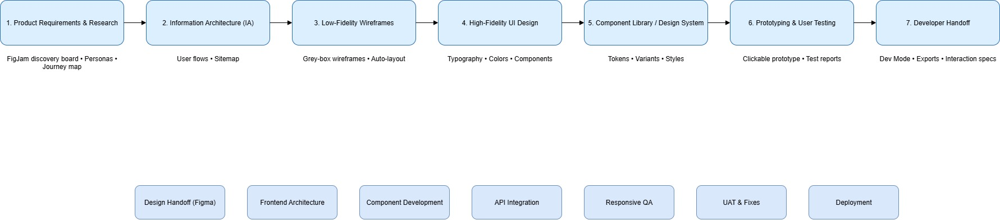

# Full Front-End Team (Industry Standard) Workflow 
A Detailed workflow followed by the frontend team for a typical app production.

## DESIGN 

 Phase | What Happens | Tasks | Deliverables |
|------|--------------|-------------|--------------|
| **1. Product Requirements & Research** | Understand goals, users, and problems | • FigJam discovery board  • Personas • Journey map • Competitor analysis | • Research board • User personas • User journey map |
| **2. Information Architecture (IA)** | Define navigation and structure of the app | • User flows • App sitemap • FigJam flow diagrams | • Complete user flow map • Sitemap |
| **3. Low-Fidelity Wireframes** | Sketch layout and key screens | • Grey-box wireframes • Auto-layout usage • Basic screen layouts | • Wireframe set for all main screens |
| **4. High-Fidelity UI Design** | Design final screen visuals | • Apply color, typography, spacing • Use design system • Hi-fi screens | • High-fidelity screen designs |
| **5. Component Library / Design System** | Build reusable UI components | • Create components (buttons, cards, inputs) • Variants • Style tokens | • Design system • Component library |
| **6. Prototyping & User Testing** | Test flow and interactions | • Clickable prototypes • Smart animate • Add interactions | • Prototype for testing • Feedback list |
| **7. Developer Handoff** | Prepare files for development | • Dev Mode • Asset export • Documentation • Interaction specs | • Dev-ready screens • Assets • Dev handoff page |

## DEVELOPMENT

| Step | Phase | What Happens | Deliverables |
|------|--------|---------------|--------------|
| 1 | Requirements Understanding | Review PRD, clarify product goals, ask questions | Confirmed requirements, notes |
| 2 | Figma Review / Design Clarification | Inspect Dev Mode, check spacing/tokens/variants, clarify breakpoints & animations | Final design understanding, design clarifications |
| 3 | Tech Stack Selection | Choose framework (React/Next.js/Vue/Angular), select libraries (Tailwind, shadcn, Redux, Zustand, Axios) | Chosen tech stack & dependencies |
| 4 | Component Architecture Planning | Plan folder structure, naming conventions, reusable components | Architecture document, component map |
| 5 | Convert Figma → Code | Use design tokens, build layouts, implement spacing, animations, prototypes | Built UI components + screens |
| 6 | API Integration | Connect UI to backend, handle loading/success/error states | Functional screens with data |
| 7 | QA Testing | Cross-browser/device checks, pixel-perfect testing, responsiveness review | QA bug list, fixes |
| 8 | Performance Optimization | Optimize images, lazy loading, code splitting | Improved performance metrics |
| 9 | Accessibility Compliance | Apply ARIA tags, keyboard navigation, contrast checks | Accessible UI meeting standards |
| 10 | Code Review + Merge | Create PR, team review, fix comments, merge to dev branch | Approved PR, merged code |
| 11 | Deployment | Staging → Production, CI/CD pipeline | Live product release |

